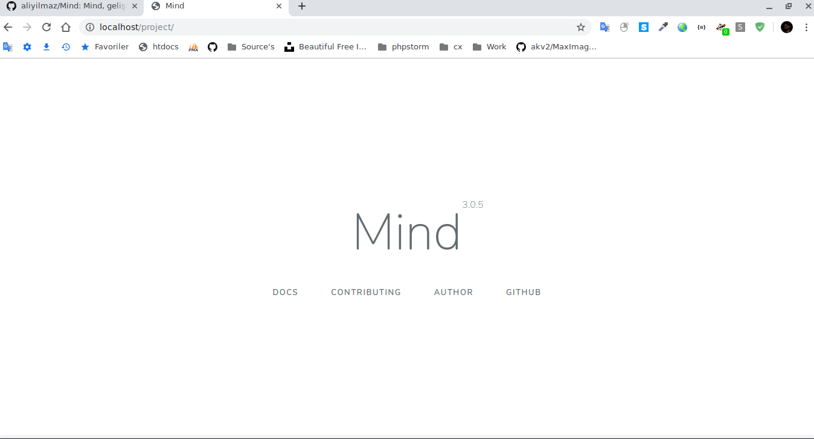
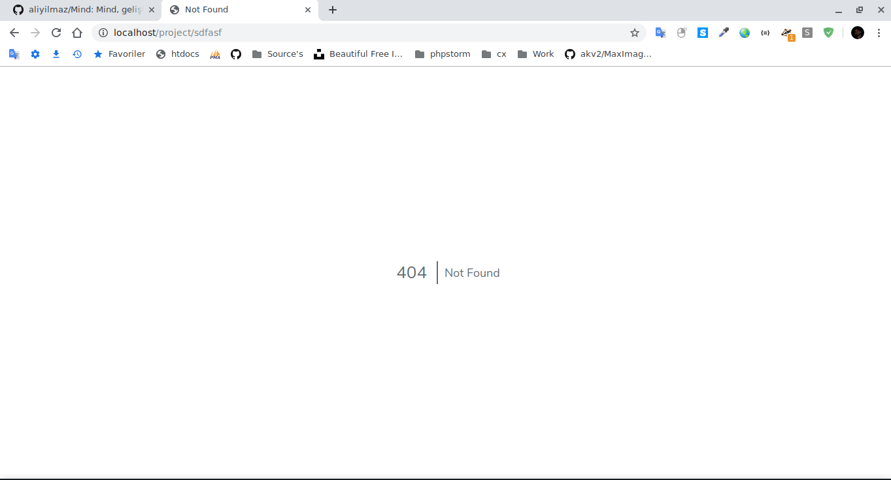

# project nedir?
Mind framework ile proje geliştirmeye hemen başlamanız için oluşturulmuş yalın proje örneğidir. 

## Nasıl edinilir?

[Burayı tıklayıp](https://github.com/aliyilmaz/project/archive/refs/heads/master.zip) projeyi indirebilirsiniz.

## Nasıl kurulur?
* Sunucunuza dosyaları ister bir klasör içinde olacak şekilde isterseniz de olduğu gibi çıkarın
* index.php dosyasında ki veritabanı bilgilerinizi güncelleyin.
* Artık internet tarayıcınızın adres satırından projeye erişebilirsiniz.

## Nasıl kullanılır?
Mind, rota adresine tanımlanan katmanların geliştirilmesinde kullanılır. Tüm katmanlar içinde Mind'ın bütün metotlarını `$this` ön eki yardımıyla kullanabilirsiniz.

## Metotlar

##### Temel

-   [__construct](https://github.com/aliyilmaz/Mind/blob/master/docs/tr-readme.md#__construct)
-   [__destruct](https://github.com/aliyilmaz/Mind/blob/master/docs/tr-readme.md#__destruct)

##### Veritabanı

-   [selectDB](https://github.com/aliyilmaz/Mind/blob/master/docs/tr-readme.md#selectDB)
-   [dbList](https://github.com/aliyilmaz/Mind/blob/master/docs/tr-readme.md#dbList)
-   [tableList](https://github.com/aliyilmaz/Mind/blob/master/docs/tr-readme.md#tableList)
-   [columnList](https://github.com/aliyilmaz/Mind/blob/master/docs/tr-readme.md#columnList)
-   [dbCreate](https://github.com/aliyilmaz/Mind/blob/master/docs/tr-readme.md#dbCreate)
-   [tableCreate](https://github.com/aliyilmaz/Mind/blob/master/docs/tr-readme.md#tableCreate)
-   [columnCreate](https://github.com/aliyilmaz/Mind/blob/master/docs/tr-readme.md#columnCreate)
-   [dbDelete](https://github.com/aliyilmaz/Mind/blob/master/docs/tr-readme.md#dbDelete)
-   [tableDelete](https://github.com/aliyilmaz/Mind/blob/master/docs/tr-readme.md#tableDelete)
-   [columnDelete](https://github.com/aliyilmaz/Mind/blob/master/docs/tr-readme.md#columnDelete)
-   [dbClear](https://github.com/aliyilmaz/Mind/blob/master/docs/tr-readme.md#dbClear)
-   [tableClear](https://github.com/aliyilmaz/Mind/blob/master/docs/tr-readme.md#tableClear)
-   [columnClear](https://github.com/aliyilmaz/Mind/blob/master/docs/tr-readme.md#columnClear)
-   [insert](https://github.com/aliyilmaz/Mind/blob/master/docs/tr-readme.md#insert)
-   [update](https://github.com/aliyilmaz/Mind/blob/master/docs/tr-readme.md#update)
-   [delete](https://github.com/aliyilmaz/Mind/blob/master/docs/tr-readme.md#delete)
-   [getData](https://github.com/aliyilmaz/Mind/blob/master/docs/tr-readme.md#getData)
-   [samantha](https://github.com/aliyilmaz/Mind/blob/master/docs/tr-readme.md#samantha)
-   [theodore](https://github.com/aliyilmaz/Mind/blob/master/docs/tr-readme.md#theodore)
-   [amelia](https://github.com/aliyilmaz/Mind/blob/master/docs/tr-readme.md#amelia)
-   [do_have](https://github.com/aliyilmaz/Mind/blob/master/docs/tr-readme.md#do_have)
-   [newId](https://github.com/aliyilmaz/Mind/blob/master/docs/tr-readme.md#newId)
-   [increments](https://github.com/aliyilmaz/Mind/blob/master/docs/tr-readme.md#increments)
-   [tableInterpriter](https://github.com/aliyilmaz/Mind/blob/master/docs/tr-readme.md#tableInterpriter)
-   [backup](https://github.com/aliyilmaz/Mind/blob/master/docs/tr-readme.md#backup)
-   [restore](https://github.com/aliyilmaz/Mind/blob/master/docs/tr-readme.md#restore)
-   [pagination](https://github.com/aliyilmaz/Mind/blob/master/docs/tr-readme.md#pagination)
-   [translate](https://github.com/aliyilmaz/Mind/blob/master/docs/tr-readme.md#translate)

##### Doğrulayıcı

-   [is_db](https://github.com/aliyilmaz/Mind/blob/master/docs/tr-readme.md#is_db)
-   [is_table](https://github.com/aliyilmaz/Mind/blob/master/docs/tr-readme.md#is_table)
-   [is_column](https://github.com/aliyilmaz/Mind/blob/master/docs/tr-readme.md#is_column)
-   [is_phone](https://github.com/aliyilmaz/Mind/blob/master/docs/tr-readme.md#is_phone)
-   [is_date](https://github.com/aliyilmaz/Mind/blob/master/docs/tr-readme.md#is_date)
-   [is_email](https://github.com/aliyilmaz/Mind/blob/master/docs/tr-readme.md#is_email)
-   [is_type](https://github.com/aliyilmaz/Mind/blob/master/docs/tr-readme.md#is_type)
-   [is_size](https://github.com/aliyilmaz/Mind/blob/master/docs/tr-readme.md#is_size)
-   [is_color](https://github.com/aliyilmaz/Mind/blob/master/docs/tr-readme.md#is_color)
-   [is_url](https://github.com/aliyilmaz/Mind/blob/master/docs/tr-readme.md#is_url)
-   [is_http](https://github.com/aliyilmaz/Mind/blob/master/docs/tr-readme.md#is_http)
-   [is_https](https://github.com/aliyilmaz/Mind/blob/master/docs/tr-readme.md#is_https)
-   [is_json](https://github.com/aliyilmaz/Mind/blob/master/docs/tr-readme.md#is_json)
-   [is_age](https://github.com/aliyilmaz/Mind/blob/master/docs/tr-readme.md#is_age)
-   [is_iban](https://github.com/aliyilmaz/Mind/blob/master/docs/tr-readme.md#is_iban)
-   [is_ipv4](https://github.com/aliyilmaz/Mind/blob/master/docs/tr-readme.md#is_ipv4)
-   [is_ipv6](https://github.com/aliyilmaz/Mind/blob/master/docs/tr-readme.md#is_ipv6)
-   [is_blood](https://github.com/aliyilmaz/Mind/blob/master/docs/tr-readme.md#is_blood)
-   [is_latitude](https://github.com/aliyilmaz/Mind/blob/master/docs/tr-readme.md#is_latitude)
-   [is_longitude](https://github.com/aliyilmaz/Mind/blob/master/docs/tr-readme.md#is_longitude)
-   [is_coordinate](https://github.com/aliyilmaz/Mind/blob/master/docs/tr-readme.md#is_coordinate)
-   [is_distance](https://github.com/aliyilmaz/Mind/blob/master/docs/tr-readme.md#is_distance)
-   [is_md5](https://github.com/aliyilmaz/Mind/blob/master/docs/tr-readme.md#is_md5)
-   [is_ssl](https://github.com/aliyilmaz/Mind/blob/master/docs/tr-readme.md#is_ssl)
-   [validate](https://github.com/aliyilmaz/Mind/blob/master/docs/tr-readme.md#validate)

##### Yardımcı

-   [accessGenerate](https://github.com/aliyilmaz/Mind/blob/master/docs/tr-readme.md#accessgenerate)
-   [print_pre](https://github.com/aliyilmaz/Mind/blob/master/docs/tr-readme.md#print_pre)
-   [arraySort](https://github.com/aliyilmaz/Mind/blob/master/docs/tr-readme.md#arraySort)
-   [info](https://github.com/aliyilmaz/Mind/blob/master/docs/tr-readme.md#info)
-   [request](https://github.com/aliyilmaz/Mind/blob/master/docs/tr-readme.md#request)
-   [filter](https://github.com/aliyilmaz/Mind/blob/master/docs/tr-readme.md#filter)
-   [firewall](https://github.com/aliyilmaz/Mind/blob/master/docs/tr-readme.md#firewall)
-   [redirect](https://github.com/aliyilmaz/Mind/blob/master/docs/tr-readme.md#redirect)
-   [permalink](https://github.com/aliyilmaz/Mind/blob/master/docs/tr-readme.md#permalink)
-   [timezones](https://github.com/aliyilmaz/Mind/blob/master/docs/tr-readme.md#timezones)
-   [languages](https://github.com/aliyilmaz/Mind/blob/master/docs/tr-readme.md#languages)
-   [currencies](https://github.com/aliyilmaz/Mind/blob/master/docs/tr-readme.md#currencies)
-   [session_check](https://github.com/aliyilmaz/Mind/blob/master/docs/tr-readme.md#session_check)
-   [remoteFileSize](https://github.com/aliyilmaz/Mind/blob/master/docs/tr-readme.md#remoteFileSize)
-   [mindLoad](https://github.com/aliyilmaz/Mind/blob/master/docs/tr-readme.md#mindLoad)
-   [cGeneration](https://github.com/aliyilmaz/Mind/blob/master/docs/tr-readme.md#cGeneration)
-   [pGeneration](https://github.com/aliyilmaz/Mind/blob/master/docs/tr-readme.md#pGeneration)
-   [generateToken](https://github.com/aliyilmaz/Mind/blob/master/docs/tr-readme.md#generateToken)
-   [coordinatesMaker](https://github.com/aliyilmaz/Mind/blob/master/docs/tr-readme.md#coordinatesMaker)
-   [encodeSize](https://github.com/aliyilmaz/Mind/blob/master/docs/tr-readme.md#encodeSize)
-   [decodeSize](https://github.com/aliyilmaz/Mind/blob/master/docs/tr-readme.md#decodeSize)

##### Sistem

-   [getOS](https://github.com/aliyilmaz/Mind/blob/master/docs/tr-readme.md#getOS)
-   [getSoftware](https://github.com/aliyilmaz/Mind/blob/master/docs/tr-readme.md#getsoftware)
-   [route](https://github.com/aliyilmaz/Mind/blob/master/docs/tr-readme.md#route)
-   [write](https://github.com/aliyilmaz/Mind/blob/master/docs/tr-readme.md#write)
-   [upload](https://github.com/aliyilmaz/Mind/blob/master/docs/tr-readme.md#upload)
-   [download](https://github.com/aliyilmaz/Mind/blob/master/docs/tr-readme.md#download)
-   [get_contents](https://github.com/aliyilmaz/Mind/blob/master/docs/tr-readme.md#get_contents)
-   [distanceMeter](https://github.com/aliyilmaz/Mind/blob/master/docs/tr-readme.md#distanceMeter)

## Ekran görüntüleri

#### Anasayfa

#### Hata sayfası
